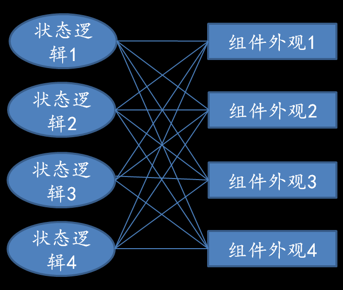
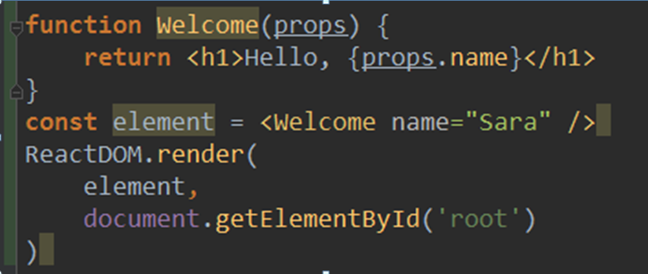

 React组件状态管理
 ================
#  setState方法
## setState方法的运行机制
setState是一个异步的方法，它被调用时并非直接修改组件的state值，而是发送一个更新事件到组件的更新事件队列里。组件每次读取队头元素，根据该元素的值更新组件的state。然后根据更新后的state重新渲染组件及其子组件。

## setState与redux的对比
setState与redux数据流动的过程具有很多的相似性
### 1. 状态变更
setState与redux的状态变更都是一个异步的过程，都是通过发送一个更新事件/action来实现。
### 2. 状态初始化
两者的state都需要初始化。
组件通过在constructor中直接对state赋值来完成state的初始化；
redux通过reducer中state的缺省值来实现初始化。
### 3. 状态变更结果
组件state值更新引起组件重新渲染；
redux store更新引起组件重新渲染。
## setState使用注意事项
1. 不可直接修改state值，state值的变更只能通过setState来实现；
2. 只有在constructor中可以对state直接赋值；
## 常见错误
### 直接修改state的值
1. 直接修改state的值违反了state数据不可变性的原则，常导致不可预料的bug的出现，因为你不知道state所指向的数据对象还在哪里被引用。
2. 这样做不会使组件重新渲染。
### constructor中调用setState进行初始化
setState是一个异步的方法，构造函数中应该采用同步的方式获取初始值
### 错误的状态更新方法
很多时候，我们需要在当前的状态值基础上进行更新。例如，问题：如何在当前状态下加1？

很多同学的做法是：this.setState({ counter: this.state.counter + 1 })
其实这是一种错误的做法。
#### 在过期的状态值上进行更新
因为setState是一个异步的方法，采用上述方式读取当前的state值后并没有立即执行更新，等到state更新开始执行时，state值可能已经发生过变化，则该更新是在过期的state基础上完成的。
#### 多个更新被合并
另外，react为了提高性能，可能会合并多个更新。

例如，在同一个更新周期内，存在两个更新：

this.setState({quantity: this.quantity + 1}) ；

this.setState({quantity: this.quantity + 2})

则react在更新时会合并这两次操作，执行效果等同如下：

this.setState(Object.assign({}, {quantity: this.quantity + 1}, {quantity: this.quantity + 2})

这样显然导致了错误的结果。

#### 正确的做法
this.setState((prevState, props) => {
    return { counter: prevState.counter + 1}
}) 

采用上述做法进行状态更新，可以保证在更新时得到的当前状态是最新的。

# 表现类组件和容器类组件
通常我们会根据位置关系将页面划分成一个个组件。然而我们依然可以对组件进一步划分成表现类组件和容器类组件。因为每个组件可以包含两个层面的内容：
1. 组件外观显示
2. 状态逻辑与任务调用
## 表现类组件（Presentational component）—— 视图层
1. 描述组件的外观；
2. 不依赖于应用的其他部分（action、store等）；
3. 只接收props，并根据props返回要渲染的视图；
4. 极少使用state，即使有少量用到，也只是关于UI的状态；
## 容器类组件（Container）——状态逻辑层
1. 描述了组件的工作方式
2. 不提供DOM markup和样式；
3. 连接应用全局数据；
4. 调用异步任务；
5. 维护组件状态；
## 例子——音乐播放器
可以把音乐播放器组件划分成表现组件和容器组件两部分：
1. 表现组件：提供播放器的外观；
2. 容器组件：实现播放器的控制逻辑——播放列表加载、暂停、播放、下一首等。
## 意义
提高代码的可读性、可维护性、可复用性。
UI与状态逻辑相分离，便于代码的阅读和维护。同时，也可以根据业务需要，方便地对表现组件/容器组件进行替换或组合。

# 无状态函数式组件
无状态函数式组件是实现表现类组件的好方式

## 为什么要使用无状态函数式组件
### 强制剥离状态逻辑
无状态函数式组件不支持状态和生命周期，强制表现类组件专注于UI
### 让臃肿的组件和低劣的数据结构更容易被发现
参数太多的函数是有异味的，其臃肿低劣的数据结构容易被发现。无状态函数式组件以参数的形式传入组件的属性，则当组件属性过多时，容易被发现。
### 概念简单，容易理解
无状态函数式组件是一个纯函数，接受输入（组件属性），并产生输出（react元素）。它没有状态，不需要考虑生命周期。
### 容易测试
如上所述，它是一个纯函数，使得组件可以单独进行测试。
