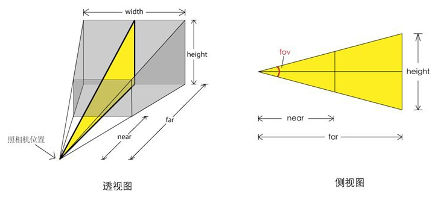
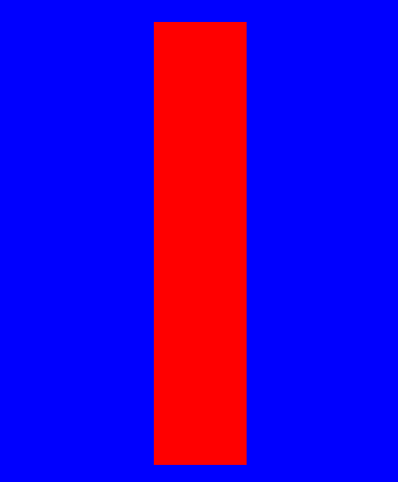

 three.js初探
 ================

- webGL 
---
WebGL是基于OpenGL ES 2.0的Web标准，可以通过HTML5 Canvas元素作为DOM接口访问，简而言之，你可以将它看做一种网络标准，定义了一些较底层的图形接口，而chrome和firefox等浏览器实现了其功能，程序员可以使用javascript来使用它

- three.js
---
Three.js是一个3D JavaScript库，封装了较底层的图形接口，使得程序员可以在不懂webGL的情况下实现更贱灵活的渲染效果，同时它也是github上的一个开源项目，因此有非常多的贡献者

- 功能介绍
---
- 照相机

我们使用three.js创建的场景是三维的，而显示器是二维的，从三维到二维上的投影方式，我们将其抽象称为照相机，具体分为正交投影和透视投影，以下为透视投影的具体方式



- 几何图形

使用three.js创建图形时，我们需要传入两个图形，几何图形和材质，几何图形抽象来讲就是一个物体的顶点信息，webGL需要程序员指定每个顶点的位置，而在three.js中，我们可以指定一些特征来创建几何图形，如使用半径来创建球体，使用长宽高定义长方体等

- 材质

材质用来表示物体顶点信息外渲染效果相关的属性，通过材质可以设置物体的颜色，纹理贴图，光照模式等

- 更多

其他还有包括光影，动画，网格等功能能，本教程仅做简要探索，其他就留给读者自己学习发掘了

- 实例
---
- 准备

去github下载three.js代码

```
https://github.com/mrdoob/three.js/tree/master/build 
```


- 引入

```html
<script type="text/javascript" src="three.js">
</script> 
```

- 主要js代码

```js
// 获取到html中的canvas并将其作为渲染器
var renderer = new THREE.WebGLRenderer({
		canvas: document.getElementById('mainCanvas')
});
// 给场景随便设置一个颜色
renderer.setClearColor(0x0000ff);
// 声明一个场景
var scene = new THREE.Scene();
// 声明一个透视投影照相机来观察我们渲染出来的图形，其参数大致如下
// THREE.PerspectiveCamera(fov, aspect, near, far)
var camera = new THREE.PerspectiveCamera(35, 6 / 3, 1, 1000);
// 设置摄像机所存在的位置
camera.position.set(0, 0, 5);
// 将摄像机绑定在在场景中
scene.add(camera)
// 设置一个图形，即我们所需要的图形
var cube = new THREE.Mesh(new THREE.CubeGeometry(1, 2, 3),
				new THREE.MeshBasicMaterial({
						color: 0xff0000
				})
);
// 将图形放置在场景中
scene.add(cube);
// 最后使用开始声明好的渲染器将场景和摄像机进行渲染
renderer.render(scene, camera);
```

- 结果



  [1]: https://read.douban.com/reader/ebook/7412854