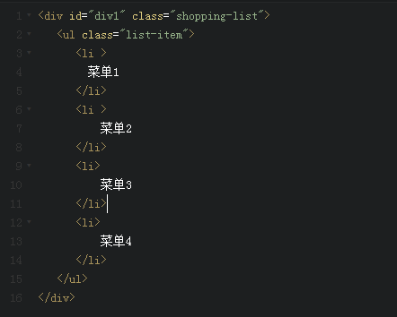
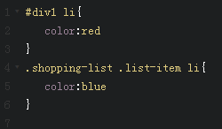

CSS选择器优先级-特殊性
===================

# 一、选择器分类
- 1.标签选择器(如：body,div,p,ul,li,a)

- 2.类选择器(如：class="shopping-list",class="head")

- 3.ID选择器(如：id="awesome",id="name_txt")

- 4.全局选择器（通配符）(如：*号)

- 5.组合选择器(如：.head .head_logo,注意两选择器用空格键分开)

- 6.群组选择器 div,span,img {color:Red} 即具有相同样式的标签分组显示用逗号隔开

- 7.继承选择器(如：div p,注意两选择器用空格键分开)

- 8.伪类选择器(如：就是链接样式,a元素的伪类，4种不同的状态：link、visited、active、hover,:first-child、:last-child、:first-of-type、:last-of-type、:nth-of-type(n)、:nth-of-last-type(n)。)

- 9.伪元素选择器(如：:after、:before等)

- 10.后代选择器 (如：#head .nav ul li 从父集到子孙集的选择器)

- 11.子选择器 (如：div>p ,带大于号>)

- 12.CSS 相邻兄弟选择器器 (如：p+p,带加号+)

# 二、优先级

## 2.1 一个简单的例子
```
HTML:
<span class="highlight">Sausage</span>

CSS:
.highlight { color: red; }
span { color: blue; }

这里span是显示什么颜色呢？
```

## 2.2 稍微复杂的例子



上图中的 ```<li>``` 该显示成什么颜色呢？

## 2.3 CSS权重

> CSS的选择器是有权重的，当不同选择器的样式设置有冲突时，会采用权重高的选择器设置样式。权重（即优先级、特殊性）的规则如下，权重越高，优先级越高。

这里为了方便理解，引入一个 **==量级==** 的优先级值（特殊性值）的概念。

优先级（特殊性）值表述为4个量级部分，如"0,0,0,0"。

一个选择器的具体优先级（特殊性）的 量级值 如下确定：

- 对于选择器中给定的各个 ID属性值，加“0,1,0,0”。
- 对于选择器中给定的各个 类选择器、属性选择器或伪类，加"0,0,1,0"。
- 对于选择器中给定的各个 元素选择器或伪元素选择器（又称标签选择器），加“0,0,0,1”。
- 结合符“+ >”和通配符“*”以及":not()"没有任何的加分权重。
- 对于行内样式，权重量级为“1,0,0,0”
- 对于"!important"加分高于上面的一切，权重量级将变成“1,0,0,0,0”

> 注意 **==不在一个量级的对比，则量级越大的优先级越高==**；即选择器优先级（特殊性）值是从左向右排序的，优先级（特殊性）值0,1,0,0大于以0开头的所有优先级值；即便它是0,0,150,99，优先级依然比0,1,0,0要低。


```
HTML:
<ul class="shopping-list" id="awesome">
    <li>
        <span>Milk</span>
    </li>
    <li class="favorite" id="must-buy">
        <span class="highlight">Sausage</span>
    </li>
</ul>
CSS:
#awesome .favorite:not(#awesome) .highlight { 
    color: red; /* 0,2,2,0 */
}
#awesome li span.highlight:nth-of-type(1):nth-last-of-type(1) { 
    color: blue; /* 0,1,3,2 */
}
```

则可以清晰的清楚上面的 ==Sausage== 是什么颜色。


> **==CSS选择器的优先级对比，首先第一点要确保的就是选择器必须是精确指向相同的对象的。==**


```
HTML:
<ul class="shopping-list" id="awesome">
    <li>
        <span>Milk</span>
    </li>
    <li class="favorite" id="must-buy">
        <span class="highlight">Sausage</span>
    </li>
</ul>
CSS:
#awesome li span { 
    color: black; /* 0,1,0,2 */
}
#awesome .favorite:not(#awesome) { 
    color: red; /* 0,2,1,0 */
}
#must-buy span.highlight { 
    color: blue; /* 0,1,1,1 */
}
.favorite span.highlight { 
    color: purple; /* 0,0,2,1 */
}
```

上面的 Milk 是黑色; Sausage 是蓝色。因为#awesome .favorite:not(#awesome)并没有精确定位到span节点。

即继承得来的属性，其优先级最低;

!important > 行内样式>ID选择器 > 类选择器 > 标签 > 通配符 > 继承 > 浏览器默认属性


# 三、怎样覆盖掉 !important

> 前面提到 对于"!important"，权重量级将变成“1,0,0,0,0”


```
#test a{  
  color: red !important; /*尽管这条声明在前，但是仍会覆盖下边的样式*/ 
  /* 1,0,1,0,1 */
}  
a{  
  color: green !important;  
  /* 1,0,0,0,1 */
}  
```

对于使用!important的属性，同样遵循量级优先级值（特殊性值）规则。
