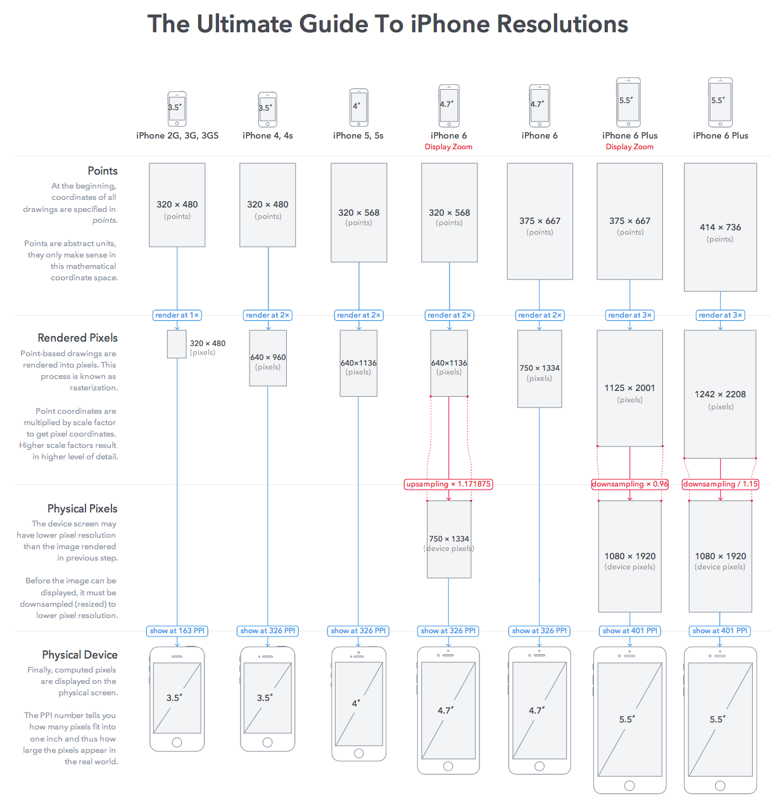

# 需求：什么是适配

一个页面在不同尺寸屏幕上显示效果一致。

## 什么是显示一致


假如要实现H5版的微信，我们希望达到的效果是，在不同屏幕尺寸的机型上，图标和文本占据的比例是一致的。左侧图标占1/5, 右侧文本占4/5，也就是在大屏手机上，图片会更大。但同时我们又不希望文字也跟着变大，不同屏幕下的字体大小应该是差不多的，大屏幕可以显示更多的文字。

**结论**: 适配就是在不同机型上实现比例一致与尺寸一致。

# 实现
<!-- more -->
## 在不同屏幕上保持比例一致

750px的UI稿中，头像宽度为150px，该怎么写样式？

```css
.avatar {
  width: 75px;
}
```
之所以设置成75px，是因为UI稿资源是2x的，而代码是1x的。

这样的代码跑在iPhone6（375px）上显示是正常的。
但是跑在iPhone5上，比例就失调了，因为头像占了75/320=0.234，而实际应该占0.2。

该怎么写样式才能保证在不同屏幕上比例一致？
- 动态设置元素像素值 （太麻烦）
- 使用其他自适应的单位 （靠谱）
  - em
  - rem

### 怎么使用rem来实现保持一致的比例

令头像宽度为1rem
```css
.avatar {
  width: 1rem;
}
```

那么iPhone6上
```css
 html {
  font-size: 75px;
 }
```

iPhone5上，1rem 实际的宽度应该是 320 * 0.2 = 64px

=>

```css
 html {
  font-size: 64px;
 }
```

### 公式化

html font-size 其实就是基值，是屏幕宽度的一个比例，在上一个例子中，这个比例值是1/5，1rem = 150px

机型 | 屏幕宽度 | html font-size 
---|---|---
UI | 750 | 150px
iPhone6 | 375 | 75px
iPhone5 | 320 | 64px

> `html font-size = 屏幕宽度 * 基准比例`

写样式时，尺寸值 = 标注值/150 rem

如果选定比例值是1/10，即1rem = 75px，尺寸值 = 标注值/75 rem

## 在不同屏幕上保持尺寸一致

尺寸一致：物理尺寸一致

### 物理尺寸：1px在不同屏幕的物理尺寸是？

物理尺寸 = 物理像素数 * 物理像素大小

物理像素 vs. 逻辑像素

单位 | 描述
---|---
逻辑像素px | 用于布局的抽象像素，iPhone6: 375 * 667
物理像素 | 也叫设备像素，屏幕上的一个物理像素点，屏幕分辨率（750 * 1334）

**一个逻辑像素的渲染过程：**

逻辑像素 -> 渲染像素 -> 物理像素



图片来源：[The Ultimate Guide To iPhone Resolutions](https://www.paintcodeapp.com/news/ultimate-guide-to-iphone-resolutions)

[一张图帮你看懂iPhone屏幕分辨率](http://iconmoon.com/blog2/iphone-6-plus-screen-size/)

从逻辑像素到渲染像素：

**dpr** - device pixel ratio, `window.devicePixelRatio`

iPhone6为例，1个逻辑像素在水平方向上被渲染成2个物理像素

从渲染像素到物理像素：1:1显示，或者采样后显示

PPI - pixel per inch
> [PPI Calculator](https://www.sven.de/dpi/)

`像素密度（PPI） = 对角线像素数量 / 屏幕尺寸`

`对角线像素数量 = ...`


忽略采样过程，最终
`字体物理尺寸 = 逻辑像素 * dpr / PPI`

机型 | 分辨率 | 屏幕尺寸(英寸) | PPI | dpr | 1px物理尺寸
---|---|---|---|---|---
iPhone3 | 320 * 480 | 3.5 | 163 | 1 | 1/163
iPhone4 |  640 * 960 | 3.5 | 326 | 2 | 1/163
iPhone5 |  640 * 1136 | 4 | 326 | 2 | 1/163
iPhone6 |  750 * 1334 | 4.7 | 326 | 2 | 1/163
iPhone6+ |  640 * 1336 | 5.5 | 401 | 3 | 3/401 = 1/134

**结论：**
1px在不同机型上显示的宽度是一致的

### 字体值该是多少？
假设750px UI稿上，h1字体大小为48px；

开发时，我们面对的是1x的画布，所以对应字体大小应该除2，即24px。

## 方案综合

- 设置html font-size为`屏幕宽度 * 基准比例`
  * 假设基准比例是1/10，那么1rem = 75px
  * iPhone6 html font-size: 37.5px
  * iPhone5 html font-size: 32px

- 对于需要保持一致比例的元素，单位用`rem`
  * 值为UI稿标注值/75

- 对于需要保持一致大小的元素，单位用`px`
  * 字体值为标注值/2

最终样式：
```css
.avatar {
  width: 1rem;
}

h1 {
  font-size: 24px;
}
```

貌似和flexible方案不一样，且往下看。

# 1px border问题
在Retina屏幕上（drp > 1），1px的border显示偏粗、模糊，UI希望1px仅用1个物理像素来显示。

## 原因

前面说过，在dpr = 2的机型上，1个逻辑像素在一个方向上会被渲染成2个物理像素，所以 `border: 1px solid #000;` 在2x屏上实际上是由两行像素点显示的，所以看起来模糊。


## 解决
[7种方法解决移动端Retina屏幕1px边框问题：](http://www.jianshu.com/p/7e63f5a32636)

- 0.5px边框
- border-image
- background-image
- 多背景渐变
- box-shadow模拟
- 伪类 + transform 
- **viewport + rem**

viewport + rem方案，适用于所有场景，不用hack，唯一的缺点是适用于新项目，老项目修改代价太大。

# Flexible (viewport + rem) 方案

设置viewport缩放比例为1/dpr

即2x viewport 缩小1/2，3x缩小1/3，于是在2x屏幕上，1px的border，被缩小成了0.5px，最终由1个物理像素渲染；在3x屏幕上，border被缩小成0.3333px，最终也是1个物理像素渲染。

viewport缩小后，解决了1px border的问题，但是把其他元素如字体、图片都缩小了，需要对之前的方案做修正。

原来的方案：
- 设置html font-size为`屏幕宽度 * 基准比例`
  * 假设基准比例是1/10，那么1rem = 75px
  * iPhone6 html font-size: 37.5px
  * iPhone5 html font-size: 32px

- 对于需要保持一致比例的元素，单位用`rem`
  * 值为UI稿标注值/75

- 对于需要保持一致大小的元素，单位用`px`
  * 字体值为标注值/2

页面缩小了dpr倍，那么屏幕能容纳的宽度就增大了dpr倍，于是html font-size要乘dpr，css中设置的字体大小也要乘dpr；

修正方案：
- 设置html font-size为`屏幕宽度 * 基准比例 * dpr`
  * 假设基准比例是1/10，那么1rem = 75px
  * iPhone6 html font-size: 75px
  * iPhone5 html font-size: 64px
- 对于需要保持一致比例的元素，单位用`rem`
  * UI稿标注值/75
- 对于需要保持一致大小的元素，单位用`px`
  * dpr=1的屏幕，字体值为标注值/2
  * dpr=2的屏幕，字体值为标注值
  * dpr=3的屏幕，字体值为标注值*1.5

以上就是手淘flexible方案。

[lib-flexible](https://github.com/amfe/lib-flexible/blob/master/src/flexible.js)

`lib-flexible`会根据当前屏幕宽度和dpr给html自动加上font-size和dpr属性，所以开发时，使用rem的地方要自己转换数值，用px的地方要自己加dpr属性。

```css
.avatar {
  width: 1rem;
}

h1 {
  font-size: 24px;
}

[dpr=2] h1 {
  font-size: 48px;
}

[dpr=3] h1 {
  font-size: 72px;
}
```

有许多工具将这一过程自动化了，如用less mixin或者编辑器插件实现自动转换。

这里重点推荐一个postcss插件：[postcss-flexible](https://github.com/crossjs/postcss-flexible/blob/master/index.js)，开发时只要这么写就够了
```css
.avatar {
  width: rem(150px);
}

h1 {
  font-size: dpr(48px);
}
```

# Flexible方案的升级

时代在变化，前端技术在不断的变化，Flexible从推出到现在已经过去了多年。那么Flexible还是最佳方案方案吗？这里不做更深入的探讨，请移步这篇文章：[再聊移动端页面的适配](http://www.w3cplus.com/css/vw-for-layout.html)
